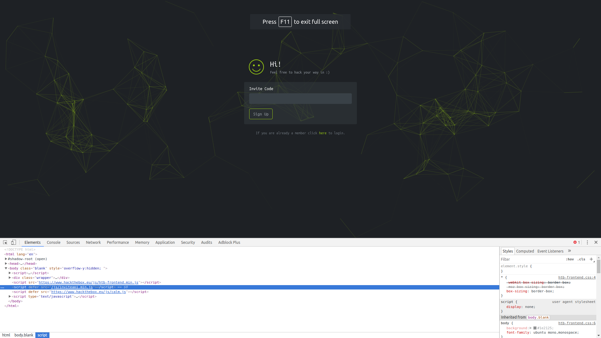
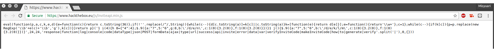
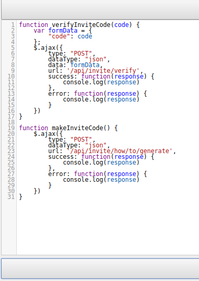
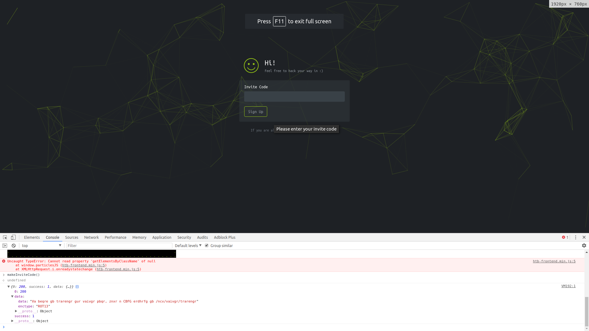
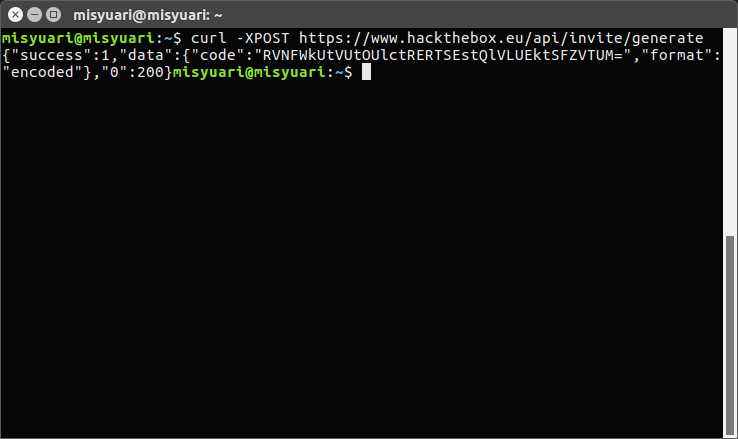
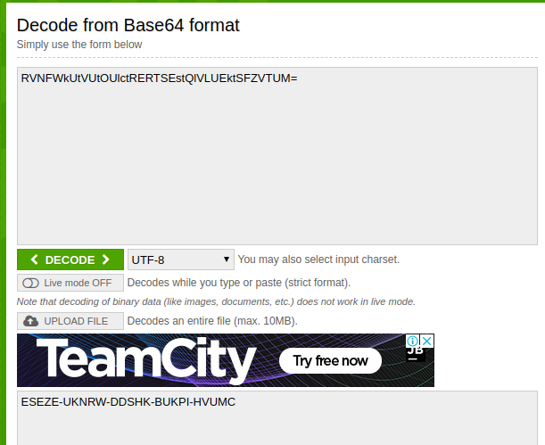

URL : https://www.hackthebox.eu/invite

1.  Klik kanan mouse, lalu pilih Inspect Element, atau tekan CTRL+SHIFT+I (Google Chrome).
2.  Cari /js/inviteapi.min.js.

3.  Klik kanan lalu open new tab, atau buka https://www.hackthebox.eu/js/inviteapi.min.js .

4.  Buka http://jsbeautifier.org/, lalu masukan JS dari https://www.hackthebox.eu/js/inviteapi.min.js .

5.  Buka tab Console lalu ketik makeInviteCode(), akan muncul respon seperti gambar dibawah.

6.  Decode data yang terdapat pada respon diatas,
    Data : Va beqre gb trarengr gur vaivgr pbqr, znxr n CBFG erdhrfg gb /ncv/vaivgr/trarengr
    EncType : ROT13
    Buka http://rot13.com/, lalu masukan data di atas.

7.  Jadi dari respon yang didapat, kita harus melakukan POST request ke https://www.hackthebox.eu/api/invite/generate.
8.  Buka terminal lalu ketik curl -XPOST https://www.hackthebox.eu/api/invite/generate

9.  Dari respon di atas, terdapat sebuah kode yang terenkripsi.
10. Buka https://www.base64decode.org/, lalu masukan kode tersebut

11. Done !
